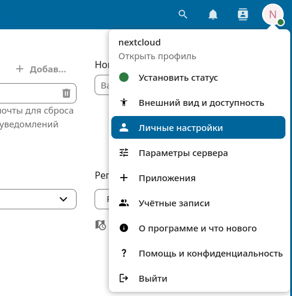
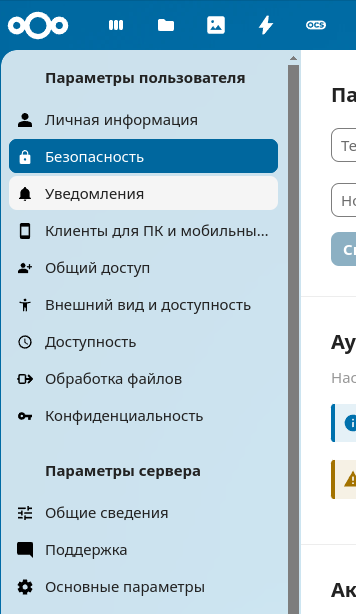
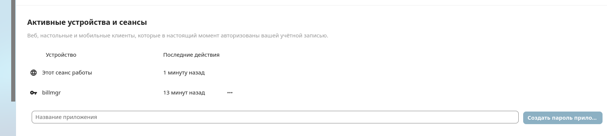
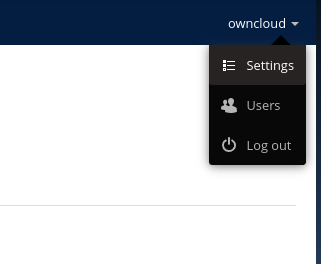
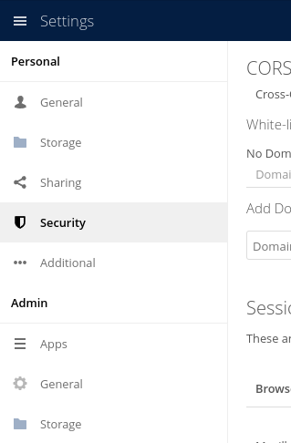
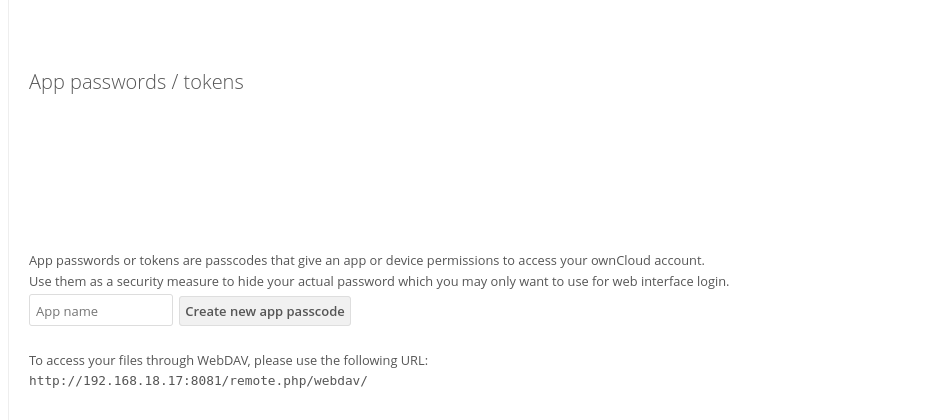

# Предназначение модуля

Модуль предназначен для интеграции возможности приобретения дискового пространства в Nextcloud/ownCloud.

# Установка

1. Необходимо установить панель Nextcloud/ownCloud (в репозитории есть `docker-compose` файл, содержащий образы для запуска обеих панелей). Чтобы избежать конфликтов, рекомендуется запускать панели Nextcloud/ownCloud в контейнерах или устанавливать их на отдельных серверах.

2. Для установки обработчика нужно клонировать данный репозиторий:

   ```bash
   git clone https://github.com/LC208/bill-nextcloud.git
   ```

3. В корневой папке склонированного репозитория выполнить команду:

   ```bash
   sh install.sh
   ```

4. Сгенерировать пароль приложения:

   **Nextcloud**  
     
     
   

   **ownCloud**  
     
     
   


5. Зарегистрировать обработчик и добавить тарифы в BILLmanager.

# Создание обработчика

При создании модуля необходимо указать логин и пароль приложения от аккаунта из группы *admin* и URL панели.
URL панели — это адрес, по которому доступна панель.

# Используемые содержания

* `disk`, `disc` — объём дискового пространства.

# Используемые параметры

* `userpassword` — пароль пользователя в панели.
* `username` — имя пользователя в панели.
* `url` — ссылка на панель.

# Первоначальная настройка

При смене тарифа аккаунт не переносится на другую панель, поэтому убедитесь, что на всех панелях группы совпадают. Либо запретите смену тарифов между разными обработчиками.

# Сбор статистики

Сбор статистики выполняется по двум возможным наименованиям:

* `disk`
* `disc`

За сбор статистики отвечает задание планировщика cron — `statdaily.cron`.
Статистика за одну и ту же дату суммируется.

# Поддерживаемые типы продуктов

* `backupservice`

