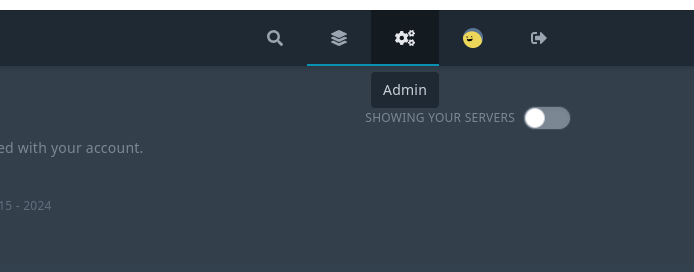
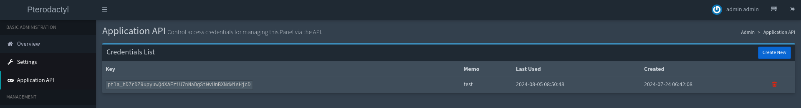
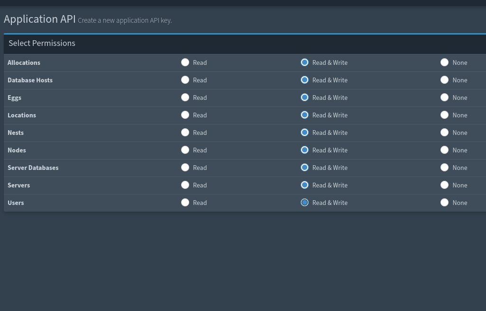
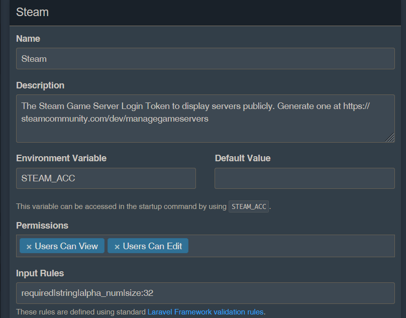
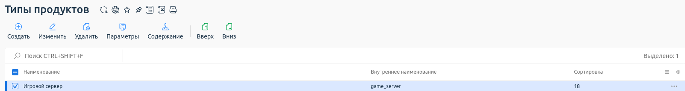
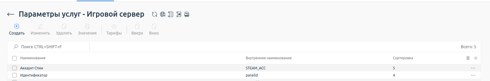
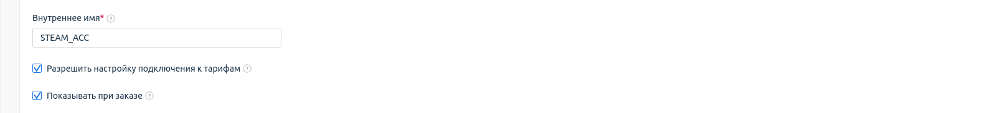
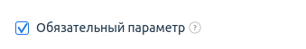
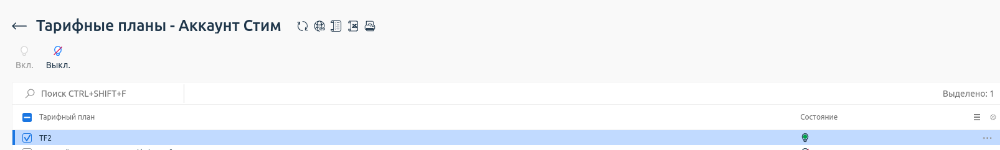
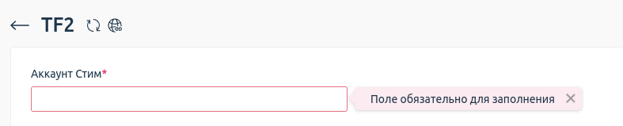

# Принцип работы модуля pterbridge
При создании модуля необходимо указать API-ключ и базовую ссылку на панель
Базовая ссылка - это адрес, по которому доступна корневая страница панели 
Ключ создается в панели pterodactyl по следующему пути: Admin -> Application API или по ссылке: базовая ссылка/admin/api

## Техническое описание:
После заказа и оплаты услуги обработчик начинает процесс ее открытия, состоящий из следующих этапов:
1) Получение API-ключа и базовой ссылки из настроек обработчика
2) Создается пользователь для данной услуги
3) Под пользователем создается сервер с указанной конфигурацией.

При истичении времени аренды сервер переходит в состояние suspended

# Установка
1) Первым шагом будет установить pterodactyl, для этого можно запустить следующие скрипты: `install-pter`(после выполнения, стоит настроить адрес для сервера nginx) и `install-pter-wings` (работоспособность проверена на ubuntu 22.04) или выполнить установку панели вручную(https://pterodactyl.io/panel/1.0/getting_started.html, https://pterodactyl.io/wings/1.0/installing.html)

Важно учесть, что pterodactyl работает с СУБД MariaDB или MySQL(зависит от настройки при установке), поэтому во избежание конфликтов pterodactyl стоит устанавливать на отдельный сервер от панели billmanager так как СУБД MariaDB и MySQL могут конфликтовать:
``` bash
./install-pter
./install-pter-wings
```
2) Установка обработчика в billmanager (перед этим необходимо установить панель billmanager):
``` bash
make Makefile
```
или просто ```make```

3) Генерация api key в pterodactyl в разделе `Application API`




4) Генерация api ключа администраторского аккаунта Account Settings -> API Credentials ({base_url}/account/api)


5) Регистрация обработчика и добавление тарифов в billmanager

## Первоначальная настройка
Администратор должен создать в pterodactyl локации и ноды, на машине, назначенной на ноду должен быть запущен демон (wings), после чего нужно назначить ноде аллокации.
Добавление ip вызывается после создания сервера, выделенный серверу ip-адрес заносится в таблицу ip. При добавлении ip-адреса pterodactyl проверяет на наличие свободного адреса, не привязаннного к ноде.
Удаление ip может происходить до того момента, пока у машины не остается один ip.
Изменение ip при изменении его в billmanager не отображается в pterodactyl (остается полностью за администратором).

## Используемые содержания:
- ncpu - количество процессоров
- mem - количество оперативной памяти
- disk disc - количество постоянной памяти
- backup_limit - предел резервных копий
- ip - количество ip-адресов
- db_limit - предел базы данных
- io_weight - приоритет в операциях ввода/вывода.
- swap_limit - ограничение раздела подкачки

## Используемые параметры
- userpassword - пароль пользователя в pterodactyl
- username - имя пользователя в pterodactyl
- serverid - имя сервера
- panelid - id игрового сервера
- ip - основной ip-адрес(без функции проверки)

Функция setparam не содержит обработку изменения параметров из billmgr в pterodactyl.
Запуск смены тарифа для услуги будет откатываться.

## Дата-центры
При создании обработчика услуг, будет присутствовать поле id локации. В нем нужно написать id локации из pterodactyl. На следующей странице нужно будет выбрать заранее созданный дата-центр.

## Шаблон
При создании тарифного плана в поле "Шаблон виртуального сервера" необходимо указать идентификаторы локации, nest и egg для данного тарифа.
Например, egg_id=1;nest_id=1.
Вместо изменения этого параметра, лучше создать новый тариф, так как изменение может повлести за собой непредвиденные ошибки.

## Поддерживаемые типы продуктов
- game_server

## Дополнительные параметры
Для каждой переменной в сочетании nest-egg в котором присутствуют required поля без default value надо добавить соостветствующий параметр в тип продукта. (см изображение ниже)

На примере TF2 есть поле STEAM_ACC, которое необходимо указать в billmgr с тем же наименованием, то есть STEAM_ACC

Продукты -> Типы продуктов


Продукты -> Типы продуктов -> Параметры




Продукты -> Типы продуктов -> Параметры -> Тарифы


От лица покупателя:


